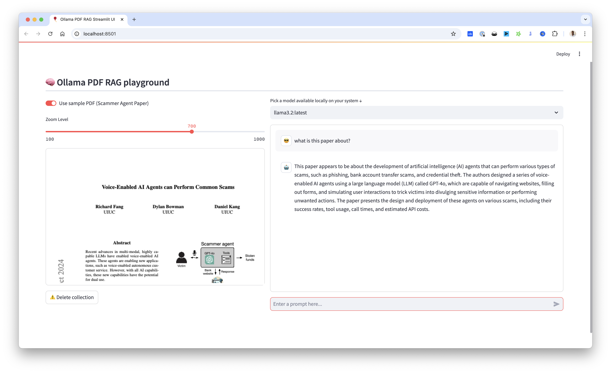

# 🤖 PG App QA Responder - PDF-based RAG Application

A powerful RAG (Retrieval Augmented Generation) application that lets you chat with your PDF documents using Ollama and LangChain. This project includes both a Jupyter notebook for experimentation and a Streamlit web interface for easy interaction.

[](https://github.com/tonykipkemboi/ollama_pdf_rag/actions/workflows/tests.yml)

## Project Structure
```
ollama_pdf_rag/
├── src/                      # Source code
│   ├── app/                  # Streamlit application
│   │   ├── components/       # UI components
│   │   │   ├── chat.py      # Chat interface
│   │   │   ├── pdf_viewer.py # PDF display
│   │   │   └── sidebar.py   # Sidebar controls
│   │   └── main.py          # Main app
│   └── core/                 # Core functionality
│       ├── document.py       # Document processing
│       ├── embeddings.py     # Vector embeddings
│       ├── llm.py           # LLM setup
│       └── rag.py           # RAG pipeline
├── data/                     # Data storage
│   ├── pdfs/                # PDF storage
│   │   └── sample/          # Sample PDFs
│   └── vectors/             # Vector DB storage
├── notebooks/               # Jupyter notebooks
│   └── experiments/         # Experimental notebooks
├── tests/                   # Unit tests
├── docs/                    # Documentation
└── run.py                   # Application runner
```

## 📺 Video Tutorial
<a href="https://youtu.be/ztBJqzBU5kc">
  
</a>

## ✨ Features

- 🔒 Secure processing with remote Ollama server support
- 📄 PDF processing with intelligent chunking
- 🧠 Multi-query retrieval for better context understanding
- 🎯 Advanced RAG implementation using LangChain
- 🖥️ Clean Streamlit interface
- 📓 Jupyter notebook for experimentation
- 🔄 Remote Ollama server integration
- 🔐 Environment-based configuration

## 🚀 Getting Started

### Prerequisites

1. **Remote Ollama Server**
   - Ensure you have access to a running Ollama server
   - Required models:
     ```bash
     ollama pull llama3.2  # or your preferred model
     ollama pull nomic-embed-text
     ```

2. **Clone Repository**
   ```bash
   git clone <your-repository-url>
   cd ollama_pdf_rag
   ```

3. **Set Up Environment**
   ```bash
   python -m venv env
   source env/bin/activate  # On Windows: .\env\Scripts\activate
   pip install -r requirements.txt
   ```

4. **Configure Environment Variables**
   ```bash
   cp .env.example .env
   ```
   Edit `.env` with your Ollama server details:
   ```
   OLLAMA_HOST=http://your-ollama-server:11434
   OLLAMA_API_KEY=your-api-key-if-required
   ```

### 🎮 Running the Application

#### Option 1: Streamlit Interface
```bash
python run.py
```
Then open your browser to `http://localhost:8501`


*Streamlit interface showing PDF viewer and chat functionality*

#### Option 2: Jupyter Notebook
```bash
jupyter notebook
```
Open `updated_rag_notebook.ipynb` to experiment with the code

## 💡 Usage Tips

1. **Upload PDF**: Use the file uploader in the Streamlit interface
2. **Select Model**: Choose from your available Ollama models
3. **Ask Questions**: Start chatting with your PDF through the chat interface
4. **Adjust Display**: Use the zoom slider to adjust PDF visibility
5. **Clean Up**: Use the "Delete Collection" button when switching documents

## 🤝 Contributing

Feel free to:
- Open issues for bugs or suggestions
- Submit pull requests
- Comment on the YouTube video for questions
- Star the repository if you find it useful!

## ⚠️ Troubleshooting

- Ensure Ollama is running in the background
- Check that required models are downloaded
- Verify Python environment is activated
- For Windows users, ensure WSL2 is properly configured if using Ollama

### Common Errors

#### ONNX DLL Error
If you encounter this error:
```
DLL load failed while importing onnx_copy2py_export: a dynamic link Library (DLL) initialization routine failed.
```

Try these solutions:
1. Install Microsoft Visual C++ Redistributable:
   - Download and install both x64 and x86 versions from [Microsoft's official website](https://learn.microsoft.com/en-us/cpp/windows/latest-supported-vc-redist)
   - Restart your computer after installation

2. If the error persists, try installing ONNX Runtime manually:
   ```bash
   pip uninstall onnxruntime onnxruntime-gpu
   pip install onnxruntime
   ```

#### CPU-Only Systems
If you're running on a CPU-only system:

1. Ensure you have the CPU version of ONNX Runtime:
   ```bash
   pip uninstall onnxruntime-gpu  # Remove GPU version if installed
   pip install onnxruntime  # Install CPU-only version
   ```

2. You may need to modify the chunk size in the code to prevent memory issues:
   - Reduce `chunk_size` to 500-1000 if you experience memory problems
   - Increase `chunk_overlap` for better context preservation

Note: The application will run slower on CPU-only systems, but it will still work effectively.

## 🧪 Testing

### Running Tests
```bash
# Run all tests
python -m unittest discover tests

# Run tests verbosely
python -m unittest discover tests -v
```

### Pre-commit Hooks
The project uses pre-commit hooks to ensure code quality. To set up:

```bash
pip install pre-commit
pre-commit install
```

This will:
- Run tests before each commit
- Run linting checks
- Ensure code quality standards are met

### Continuous Integration
The project uses GitHub Actions for CI. On every push and pull request:
- Tests are run on multiple Python versions (3.9, 3.10, 3.11)
- Dependencies are installed
- Ollama models are pulled
- Test results are uploaded as artifacts

## 📝 License

This project is open source and available under the MIT License.

---

## ⭐️ Star History

[](https://star-history.com/#tonykipkemboi/ollama_pdf_rag&Date)

Built with ❤️ by [Tony Kipkemboi!](https://tonykipkemboi.com)

Follow me on [X](https://x.com/tonykipkemboi) | [LinkedIn](https://www.linkedin.com/in/tonykipkemboi/) | [YouTube](https://www.youtube.com/@tonykipkemboi) | [GitHub](https://github.com/tonykipkemboi)

## Deployment Instructions

### Docker Deployment
1. Build the Docker image:
```bash
docker build -t ollama-pdf-rag .
```

2. Run the container:
```bash
docker run -p 8501:8501 \
  -e OLLAMA_HOST=http://your-ollama-server:11434 \
  -e OLLAMA_API_KEY=your-api-key-if-required \
  ollama-pdf-rag
```

### Production Deployment
For production deployment, consider:
1. Using a reverse proxy (e.g., Nginx) for SSL termination
2. Setting up proper authentication
3. Using a process manager (e.g., Supervisor) to keep the application running
4. Implementing proper logging and monitoring
5. Setting up regular backups of the vector store

### Security Considerations
1. Keep your Ollama API key secure
2. Use HTTPS in production
3. Implement proper access controls
4. Regularly update dependencies
5. Monitor system resources
